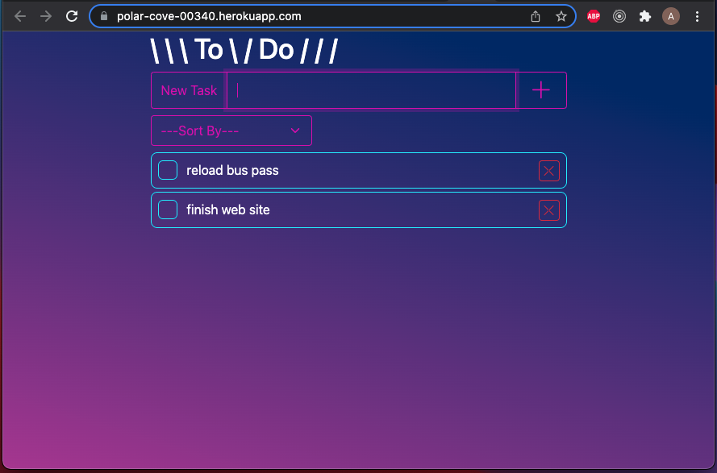
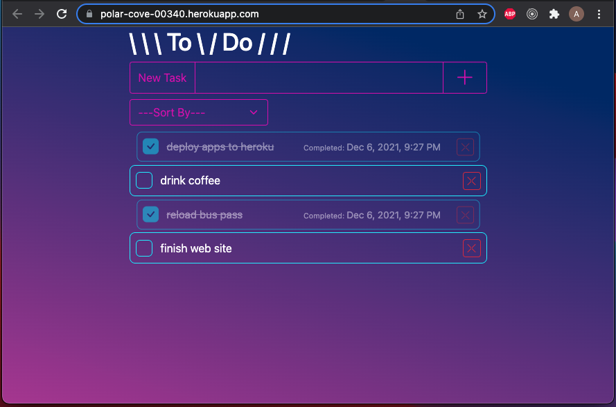
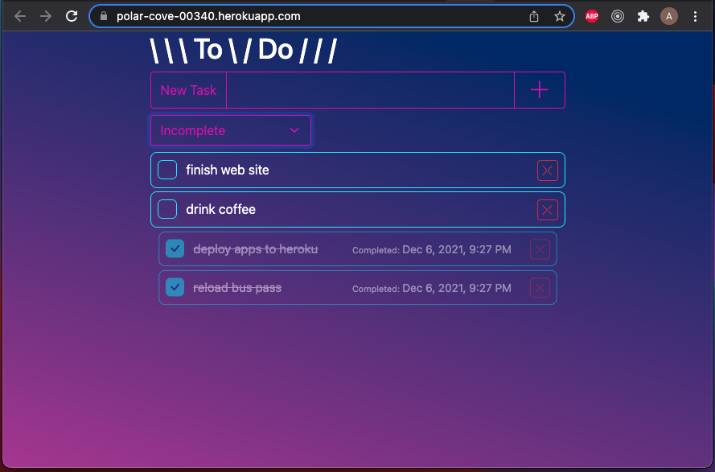

# Project Name

Weekend SQL To-Do List

## Description

Duration: Weekend (Two Days)

This is a simple full-stack to-do list implementation. The objective is to take a user input task and store it in a (local) database and subsequently display it on the DOM.

On the front-end, new tasks are requested with the POST method, and tasks are displayed using a GET request. Tasks may also be marked complete via a PUT request and deleted via DELETE request.

The server takes these requests and uses pg to query the database with the appropriate CRUD operations.

The deployed version of the app may be found [here](https://polar-cove-00340.herokuapp.com/)

## Screenshots

### Prequisites

- [Node.js](https://nodejs.org/en/)
- [Postgres](https://www.postgresql.org/download/)

## Installation

1. Create a database named `your-database-name`,
2. The queries in the `database.sql` file are set up to create the necessary table, functions, and triggers to allow the application to run correctly. The project is built on [Postgres](https://www.postgresql.org/download/), so you will need to make sure to have that installed.
3. Open up your editor and run an `npm install` to install the dependencies
4. Run `npm start` in your terminal to start the server
5. Open [localhost](http://localhost:5000/) in your browser

## Usage

1. Add a new task by typing a description and clicking the '+' button
2. Mark a task as completed by clicking the checkbox in the task entry
3. Delete a task by clicking the 'X' button in the task entry
4. Sort your list of tasks by selecting an option from the '---Sort By---' selector

## Built With

- node.js
- express.js
- Postgres
- jQuery
- Bootstrap

## Acknowledgement

Thanks to [Prime Digital Academy](www.primeacademy.io)

## Support

If you have suggestions or issues, please email me at [austin4191@gmail.com]
